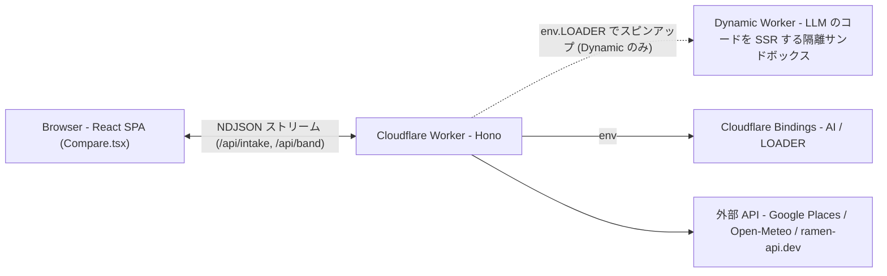
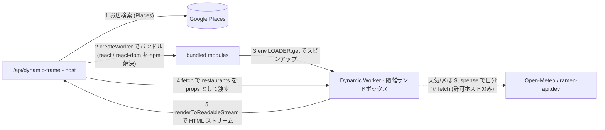

# Generative UI Playground — ご飯アドバイザー 🍻

CopilotKit が提唱する [**Generative UI Spectrum**](https://www.copilotkit.ai/generative-ui-spectrum) の 3 パターン (Static / Declarative / Open-Ended) を実演しつつ、本デモが提案する **第 4 のパターン「Dynamic」** (Code Mode + Cloudflare Worker Loader で LLM のコードを SSR) も見せる、**同じ条件のご飯プランを 4 パターンで描き分ける**比較デモ。

2026-06-06 [frontend-phpcon-do-2026](https://fortee.jp/frontend-phpcon-do-2026/proposal/3435cc2a-90b6-4f28-8394-1d0665001020) トーク「AI 時代の UI はどこへ行く？その 2！」用。

左のチャットに「すすきので金曜、4 人で接待」のように一言入れると、右に **Static / Declarative / Open-Ended / Dynamic** の 4 タブで同じプランが描き分けられる。各タブは **プレビュー / ソース / 両方** を切り替えられ、「AI が生成したもの (ソース) → どう描画されるか (プレビュー)」を並べて見せられる。

## 4 つのパターン

| パターン        | AI が生成するもの                 | 誰がデータ取得                    | 誰がレイアウト        | 描画                                |
| --------------- | --------------------------------- | --------------------------------- | --------------------- | ----------------------------------- |
| **Static**      | **ツールコールのみ** (UIに非関与) | ホスト (ツール)                   | ホスト (固定)         | フロント React (固定コンポーネント) |
| **Declarative** | **UIツリー** (JSON)               | ホスト (ツール)                   | **AI** (ツリー)       | フロント React (ツリーを再帰描画)   |
| **Open-Ended**  | **HTML** 文書全体                 | ホスト (ツール)                   | **AI** (HTML)         | iframe (sandbox + CSP + サニタイズ) |
| **Dynamic** ✨  | **React コード**                  | **コンポーネント自身** (Suspense) | **AI** (本物のコード) | Cloudflare Worker で SSR → iframe   |

スペクトラムの肝は **「AI に UI のどこまでを書かせるか」**。右に行くほど AI の自由度が上がる (データだけ → ツリー → HTML → コード)。各パターンの「ソース」トグルを見ると、AI がそのパターンで何を生成しているかが一目で分かる。

### 1 フェーズ vs 2 フェーズ

- **Static は 1 フェーズ**: AI は 1 回の `streamText` でデータツール (`get_weather` / `get_last_train` / `search_restaurants` / `get_ramen`) を**呼ぶだけ**。並び・レイアウト・文言には触れず、ホストが固定コンポーネントで描画する (= 最も純粋な Controlled)。「ツール」トグルで AI が呼んだツール列がそのまま見える。
- **Declarative / Open-Ended は 2 フェーズ**: ① ツールでデータ収集 → ② 集めたデータを使って UIツリー / HTML を生成。
- **Dynamic は事前収集しない**: AI はコンポーネントを組むだけ。天気・〆ラーメンは描画時にコンポーネントが `<Suspense>` で自分で fetch する。

## 単一の真実源: Zod カタログ

UI 部品の「契約」(各部品が受け付ける props) は [`src/schemas/catalog.ts`](./src/schemas/catalog.ts) に **Zod で 1 か所だけ**定義する (参考デモ [旅行プランナー](https://zenn.dev/peintangos/articles/5b6e952c4e8880) の json-render catalog と同じ発想)。ここから:

- **Declarative**: プロンプトの「使える部品」リストを生成 + AI が吐いた JSON ツリーを Zod で検証/正規化
- **Dynamic**: プロンプトの `declare const X: React.FC<{...}>` 型宣言を `z.toJSONSchema()` 経由で生成

を導出する。プロンプト・型・検証を手書きで 3 か所に分散させない。同じ部品名でも Declarative (ホストがデータ注入) と Dynamic (AI が props で配線) で props が違うので、エントリは `declarative` / `dynamic` を別々に持つ。

## 共有コンポーネント

[`src/ui-components.tsx`](./src/ui-components.tsx) の `ShopList` / `RamenCard` / `WeatherBanner` / `LastTrainCard` / `RestaurantCard` を **全パターンで共有**する (Dynamic Worker へは `?raw` でソースを埋め込み)。

特に **`ShopList`** がレイアウトを所有する: 店の配列を渡すと「1 軒目 / 2 軒目を横並びグリッド・〆ラーメンを専用カードで下に」を**部品の中で**やる。これにより「2 枚を Grid・1 枚を下」のような配置をホストや AI が考えなくてよい (旅行プランナーの `ItineraryTimeline` と同じく、部品が中の並びを持つ)。

## 「Dynamic」というクライマックス

```
通常の SSR (Next.js / Remix):
  開発者が書いた React コンポーネント → サーバで renderToString → HTML

このデモの Dynamic パターン:
  LLM が書いた React コンポーネント → Cloudflare Worker で renderToReadableStream → HTML
            ↑ リクエスト時に動的バンドル & スピンアップ (JIT)
```

つまり Dynamic は **「LLM が書く SSR」**。Open-Ended の延長線上だが:

- サンドボックス隔離が標準で付く (Cloudflare [Worker Loader](https://developers.cloudflare.com/workers/runtime-apis/bindings/worker-loader/))
- React 環境 (`renderToReadableStream` で Suspense ストリーミング SSR) が走る
- **型付きの実コンポーネントを借用できる** (`ShopList` / `RamenList` 等)。しかも非同期コンポーネントは描画時に自分でデータを取りに行く

「Code Mode + Worker Loader = LLM SSR の実装基盤」。Spectrum 議論はこの上に乗る枝葉、というフレームでもある。

## Tech Stack

- Cloudflare Workers + [Hono](https://hono.dev/) + React 19 SPA + [Vite](https://vite.dev/)
- [Vercel AI SDK v6](https://sdk.vercel.ai/) (`streamText` / `tool` / `stepCountIs`) + [`@ai-sdk/openai`](https://www.npmjs.com/package/@ai-sdk/openai) + [`workers-ai-provider`](https://www.npmjs.com/package/workers-ai-provider)
- [Worker Loader](https://developers.cloudflare.com/workers/runtime-apis/bindings/worker-loader/) + worker-bundler (Dynamic で LLM の Worker module を runtime バンドル → spawn → fetch、[hono-eval](https://github.com/yusukebe/hono-eval) と同じパターン)
- モデル: **GPT-4o** (既定) / GPT-4o mini / GPT-OSS 120B / Llama 3.3 70B / Llama 4 Scout / Llama 3.1 8B / Gemma 3 12B / Qwen 2.5 Coder (ドロップダウンで切替)
- データ: [Google Places (New)](https://developers.google.com/maps/documentation/places/web-service/op-overview) (店 + 写真 · 要 `GOOGLE_MAPS_API_KEY`) / [Open-Meteo](https://open-meteo.com/) (天気 · キー不要) / [ramen-api.dev](https://ramen-api.dev) (〆ラーメン · キー不要) / 終電は静的テーブル

## 開発

```bash
npm install
npm run dev      # http://localhost:5173/
```

`.dev.vars` に OpenAI / Google Places のキーを入れる:

```
OPENAI_API_KEY=sk-...
GOOGLE_MAPS_API_KEY=...
```

```bash
npm run cf-typegen   # wrangler.jsonc 変更後、CloudflareBindings 型を再生成
npm run format:fix   # prettier フォーマット
npm run build        # 本番ビルド
npm run deploy       # Cloudflare へデプロイ (本番キーは wrangler secret put)
```

---

# アーキテクチャ

## レイヤ俯瞰



## リクエストの流れ

1. **`POST /api/intake`** — 1 行入力から条件 (日付 / エリア / 人数 / 用途 / 食べたいもの) を抽出。足りなければ AI が聞き返す。
2. **`POST /api/band`** — `{ band, params, model }` を受け、`streamBand()` がそのパターンの「収集 → 描画」を NDJSON で逐次返す (`tool` / `weather` / `lasttrain` / `izakaya` / `ramen` / `render-start` / パターン別イベント / `metrics`)。4 タブはそれぞれ独立に叩く。
3. **`POST /api/dynamic-frame`** — Dynamic 用。`{ code, restaurants }` を受け、LLM の React コードを Worker でストリーミング SSR して HTML を返す (iframe の中身)。
4. **`GET /api/places-photo`** — Google Places の写真をプロキシ (API キーを隠蔽)。

## Dynamic Worker サンドボックス (Dynamic パターンのみ)

`renderDynamicComponentStream()` が、LLM が書いた `function App({ restaurants })` を **完全な Worker module に包んで** worker-bundler でランタイムバンドルし、`env.LOADER.get(...)` で**新しい Worker をスピンアップ**、`renderToReadableStream` で **Suspense ストリーミング SSR** する。



worker-bundler の入力ファイル:

| ファイル                | 中身                                                                                   |
| ----------------------- | -------------------------------------------------------------------------------------- |
| `src/index.tsx`         | LLM の `App` を包んだ Worker module (`renderToReadableStream`)                         |
| `src/restaurant-ui.tsx` | 非同期フック + worker 用コンポーネント (`Weather` / `RamenList` / `LastTrain` 等)      |
| `src/base-ui.tsx`       | `src/ui-components.tsx` のソース (`?raw`)。`ShopList` / `RamenCard` 等を借用可能にする |
| `package.json`          | `{ "dependencies": { "react": "^19.2.6", "react-dom": "^19.2.6" } }`                   |

Worker 内では `react-dom/server.edge` (workerd 互換) を使うため、host 側で import を `.edge` に書き換えている。

## Open-Ended のセキュリティ (多層防御)

AI が書いた HTML を iframe に流す前に、参考実装と同等以上の多層防御をかける ([`OpenEndedView.tsx`](./src/client/modes/OpenEndedView.tsx)):

1. **正規表現サニタイズ** — `javascript:` / `vbscript:` スキームと `on*=` イベントハンドラ属性を無効化
2. **CSP で通信遮断** — `default-src 'none'` / `connect-src 'none'` / `object-src 'none'` / `form-action 'none'`。`img-src` も `'self'` + `ramen-api.dev` に絞り、画像ビーコンによるデータ送信も塞ぐ
3. **iframe sandbox で隔離** — `sandbox="allow-scripts"` (same-origin なし)
4. **srcdoc で opaque origin** — 親や外部にアクセスできない

## 主要ファイル

```
src/
  index.tsx                Hono Worker entry (/api/intake, /api/band, /api/dynamic-frame, /api/places-photo)
  compare.ts               streamBand() — 4 パターンの「収集 → 描画」を NDJSON で生成 (デモの心臓部)
  llm.ts                   resolveModel() — OpenAI / Workers AI のモデル解決
  models.ts                モデルレジストリ (GPT-4o ほか 8 モデル)
  ui-components.tsx         共有 UI 部品 (ShopList / RamenCard / WeatherBanner / 等)。Dynamic Worker にも ?raw で埋め込み
  schemas/
    catalog.ts             ★ UI 部品の Zod カタログ (単一の真実源)。プロンプト生成 + 検証 + 型宣言生成
    plan.ts                intake / plan の Zod スキーマ
    declarative.ts         DeclNode 型 (UIツリーのノード)
  tools/
    weather.ts             Open-Meteo (エリア別座標で取得)
    lasttrain.ts           終電の静的テーブル (札幌 / 横浜)
    places.ts              Google Places (New) searchText + 写真
    search-restaurants.ts  店検索ツール
    ramen.ts               ramen-api.dev (?prefecture= で絞り込み)
    render-ui.ts           Open-Ended の HTML 抽出ヘルパ
    dynamic-render.ts      Dynamic — worker-bundler + LOADER で LLM コードを Suspense SSR
  client/
    main.tsx               React entry
    Compare.tsx            メイン UI (4 タブ + プレビュー/ソース/両方トグル + メトリクス)
    StreamFrame.tsx        Dynamic フレーム (iframe + 高さ通知)
    modes/
      PlanView.tsx         Static の描画 (ShopList でスケルトン → データ)
      DeclarativeView.tsx  Declarative の再帰描画 (カタログのノードを React へ)
      OpenEndedView.tsx    Open-Ended の iframe ラッパ (多層防御)

wrangler.jsonc             AI / LOADER バインド・vars
```

> 注: `agent.ts` / `Chat.tsx` / `ControlledView.tsx` / `search-restaurants.ts` 等は旧 Chat/Agents SDK 経路の名残で、現デモ (`Compare.tsx`) では未使用。

## デバグ

`npm run dev` で起動し、Chrome DevTools MCP もしくは通常の DevTools でネットワーク / コンソールを確認。詳細な現状ステータス・登壇構成は **[AGENTS.md](./AGENTS.md)** を参照。
