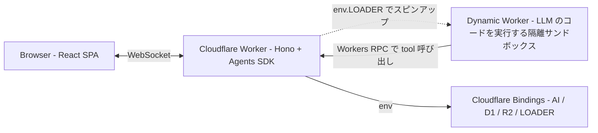
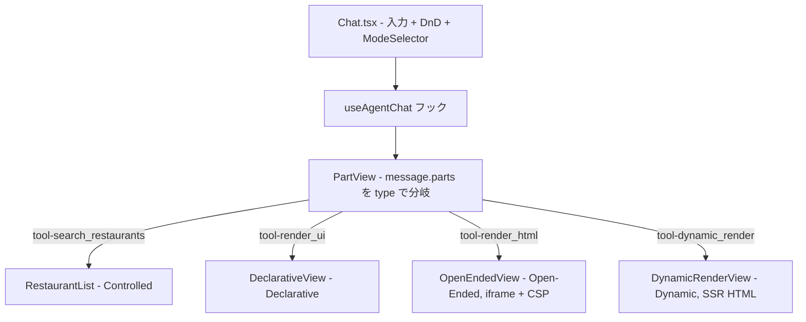
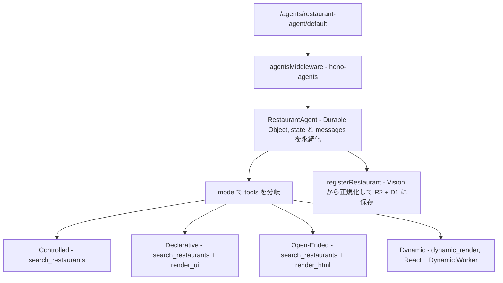
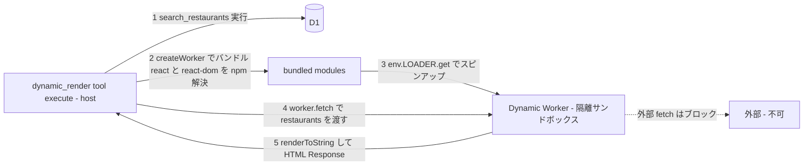
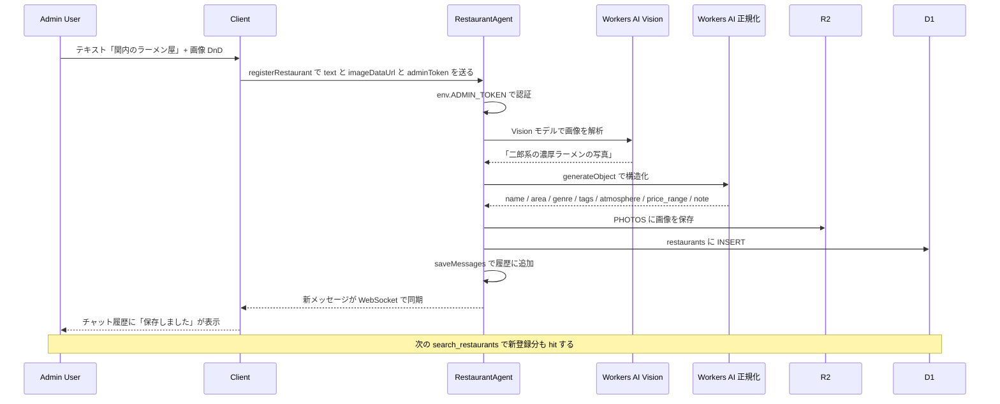

# Generative UI Playground

CopilotKit が提唱する [**Generative UI Spectrum**](https://www.copilotkit.ai/generative-ui-spectrum) (Controlled / Declarative / Open-Ended) の 3 バンドを実演しつつ、本デモが提案する **第 4 のバンド「Dynamic」** (Code Mode + Dynamic Worker + JSX SSR) も見せるレストラン提案アプリ。

2026-06-06 [frontend-phpcon-do-2026](https://fortee.jp/frontend-phpcon-do-2026/proposal/3435cc2a-90b6-4f28-8394-1d0665001020) トーク「AI 時代の UI はどこへ行く？その 2！」用。

## 4 つのバンド

| バンド          | LLM 出力                                            | 描画                                                                |
| --------------- | --------------------------------------------------- | ------------------------------------------------------------------- |
| **Controlled**  | tool call `search_restaurants`                      | 事前定義 React コンポーネント (`RestaurantList`) で dispatch        |
| **Declarative** | tool call `render_ui` (JSON UI ツリー)              | プリミティブ語彙 (Section / Card) を再帰描画                        |
| **Open-Ended**  | tool call `render_html` (HTML 文字列)               | `<iframe sandbox>` + CSP で実行                                     |
| **Dynamic** ✨  | tool call `dynamic_render` (**JSX で動的にコード**) | **Cloudflare Dynamic Worker で SSR**、`<RestaurantList />` も借用可 |

並走サブテーマ: **「フォーム UI は消える」** — レストラン登録は専用フォームではなく、チャット入力 + 写真 DnD で行い、LLM が曖昧な自然言語入力を Workers AI Vision で正規化する。

## 「Dynamic」というクライマックス

```
通常の SSR (Next.js / Remix):
  開発者が書いた React コンポーネント → サーバで renderToString → HTML

このデモの Dynamic バンド:
  LLM が書いた React コンポーネント → Dynamic Worker で renderToString → HTML
            ↑ リクエスト時に動的生成 (JIT)
```

つまり Dynamic は **「LLM が書く SSR」**。Open-Ended の延長線上だが:

- サンドボックス隔離が標準で付く (Cloudflare Worker Loader)
- React 環境 (renderToString) が走る
- 既存コンポーネントを **借用できる** (Spectrum を内側でグラデーションできる)

「Code Mode + Dynamic Worker = LLM SSR の実装基盤」。Spectrum 議論はこの上に乗る枝葉、というフレームでもある。

## Tech Stack

- Cloudflare Workers + [Hono](https://hono.dev/) + [hono-agents](https://www.npmjs.com/package/hono-agents)
- React 19 + Vite
- [Cloudflare Agents SDK](https://developers.cloudflare.com/agents/) (Durable Object として Agent を保持)
- [@cloudflare/worker-bundler](https://www.npmjs.com/package/@cloudflare/worker-bundler) + [Worker Loader](https://developers.cloudflare.com/workers/runtime-apis/bindings/worker-loader/) (Dynamic バンドで LLM の Worker module を runtime バンドル → spawn → fetch)
- Workers AI (Llama 3.3 70B fp8 fast / Llama 4 Scout / Llama 3.1 8B / Gemma 3 / Qwen 2.5 Coder)
- D1 (レストラン) + R2 (写真)

## 開発

```bash
bun install
bun run dev               # http://localhost:5173/
bun run db:migrate:local  # D1 マイグレーション + シード (横浜 18 件) を投入
```

```bash
bun run cf-typegen        # wrangler.jsonc 変更後、型を再生成
bun run format:fix        # prettier フォーマット
bun run build             # 本番ビルド
bun run deploy            # Cloudflare へデプロイ
```

`.dev.vars` に `ADMIN_TOKEN=local-admin` 等を入れておくと、登録機能が admin 限定になる (本番は `wrangler secret put ADMIN_TOKEN`)。

---

# アーキテクチャ解説

## レイヤ俯瞰



## Layer 1 — Browser

`Chat.tsx` は `useAgentChat` フックで Agent と双方向通信し、メッセージの `parts` を `PartView` が type で分岐。バンドごとに異なる tool 結果を専用 View に振り分ける。



## Layer 2 — Worker (Hono + Agent)

`/agents/*` を `agentsMiddleware` が引き受け、Durable Object として動く `RestaurantAgent` に到達。Agent は `state` (model + mode) と `messages` (会話履歴) を SQLite に永続化、`onChatMessage` でモードに応じた tools を選択。



## Layer 3 — Dynamic Worker サンドボックス (Dynamic バンドのみ)

`dynamic_render` ツール実行時、`@cloudflare/worker-bundler` で LLM が書いた **完全な Cloudflare Worker module** をランタイムでバンドルし、`env.LOADER.get(...)` で **新しい Worker をスピンアップ**して `worker.getEntrypoint().fetch(request)` で実行する ([hono-eval](https://github.com/yusukebe/hono-eval) と同じパターン)。

ホスト側で先に `search_restaurants` を実行し、結果を `request.body` に乗せて Worker に渡す。Worker は React で `renderToString` を呼んで HTML を生成し、`Response` として返す。



worker-bundler の入力 (`createWorker`):

| ファイル                | 中身                                                                            |
| ----------------------- | ------------------------------------------------------------------------------- |
| `src/index.tsx`         | LLM が書いた Worker module (export default { async fetch(request) {...} })      |
| `src/restaurant-ui.tsx` | `src/ui-components.tsx` の中身を `'./restaurant-ui'` で借用可能にするためコピー |
| `package.json`          | `{ "dependencies": { "react": "^19.2.6", "react-dom": "^19.2.6" } }`            |

Worker 内で `react-dom/server.edge` (workerd 互換ビルド) を使うため、`react-dom/server` という拡張子なし import は **host 側で `react-dom/server.edge` に書き換え**ている (node 版は `util` を require するため Worker runtime で動かない)。`prompt` でも `.edge` を必ず使うよう LLM に指示している。

## 各バンドの LLM 出力例

### Controlled (古典)

LLM は `search_restaurants` を呼ぶだけ。一覧表示はクライアントが自動で行う。

```ts
// LLM が出す tool call
search_restaurants({ area: '関内', atmosphere: '静か' })
// → { restaurants: [...] } → クライアントが <RestaurantList /> でレンダ
```

### Declarative (古典)

`search_restaurants` の後、`render_ui` で Section / Card のツリーを返す。

```ts
render_ui({
  title: '関内のオススメ',
  sections: [
    {
      heading: '雰囲気重視',
      cards: [
        {
          title: 'BAR Kingdom',
          subtitle: '関内 / バー',
          body: '...',
          tags: ['静か'],
        },
      ],
    },
  ],
})
// → render_ui は echo back、クライアントが DeclarativeView で再帰描画
```

### Open-Ended (古典)

`render_html` で完全な HTML 文書を返す。

```ts
render_html({ html: '<!doctype html><html>...</html>' })
// → クライアントが iframe (allow-scripts + CSP) に流す
```

### Dynamic ✨ (新)

`dynamic_render` で **JSX を含む完全な Cloudflare Worker module** を渡す。host 側で `search_restaurants` を実行 → bundled Worker を spawn → `worker.fetch(request)` で SSR HTML を取得。

```tsx
import React from 'react'
import { renderToString } from 'react-dom/server.edge'
import { RestaurantList } from './restaurant-ui'

export default {
  async fetch(request) {
    const { restaurants } = await request.json()
    // 既存コンポーネントを借りる (= Controlled 寄り) / 自分で組む (= Open-Ended 寄り) を自由に選べる
    const html = renderToString(<RestaurantList restaurants={restaurants} />)
    return new Response('<!doctype html>' + html, {
      headers: { 'content-type': 'text/html' },
    })
  },
}
```

## 「フォーム UI は消える」登録フロー (Admin 限定)



## 主要ファイル

```
src/
  index.tsx                 Hono Worker entry。/agents/* を hono-agents へ
  agent.ts                  RestaurantAgent (4 バンドで tools と prompt を分岐)
  modes.ts                  Mode 型 (4 バンド) + MODES 一覧
  models.ts                 Model レジストリ (5 モデル, default は Llama 3.3 70B fp8 fast)
  types.ts                  Restaurant 型 + D1 行 → Restaurant のマッパ
  ui-components.tsx         共有 UI コンポーネント (Chat + Dynamic Worker 両方で使う)
                            ※ インラインスタイル、React のみ依存、self-contained
  schemas/
    declarative.ts          Section / Card プリミティブの Zod
  tools/
    search-restaurants.ts   D1 検索ツール (全バンド共通)
    render-ui.ts            render_ui / render_html (echo back ツール)
    dynamic-render.ts       Dynamic バンド用 tool (worker-bundler + LOADER で
                            LLM の Worker module を bundle → spawn → fetch)
    add-restaurant.ts       Vision + 正規化 + D1 + R2 の登録パイプライン
  client/
    main.tsx                React entry
    App.tsx                 サイドバー + メインペインのレイアウト
    Chat.tsx                useAgentChat + PartView (4 種類の tool 結果を分岐)
    ModelSelector.tsx       モデルドロップダウン
    ModeSelector.tsx        4 バンドのセグメントコントロール
    modes/
      DeclarativeView.tsx   Declarative バンドの再帰描画
      OpenEndedView.tsx     Open-Ended / Dynamic バンドの iframe ラッパ

migrations/                 D1 マイグレーション (init + reseed 横浜 18 件)
wrangler.jsonc              D1 / R2 / Agent (DO) / AI / LOADER バインド
```

## デバグ

dev サーバを `bun run dev` で立ち上げ、Chrome DevTools MCP もしくは普通の DevTools でネットワーク / コンソールを確認。

詳細な現状ステータス・登壇構成・未完了タスクは **[AGENTS.md](./AGENTS.md)** を参照。
