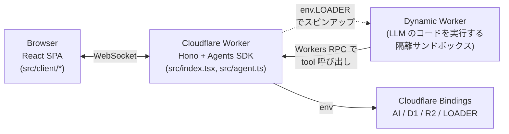
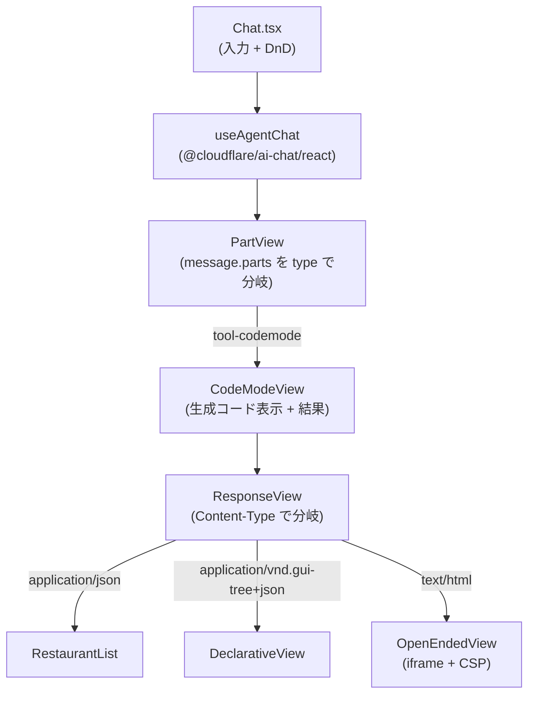
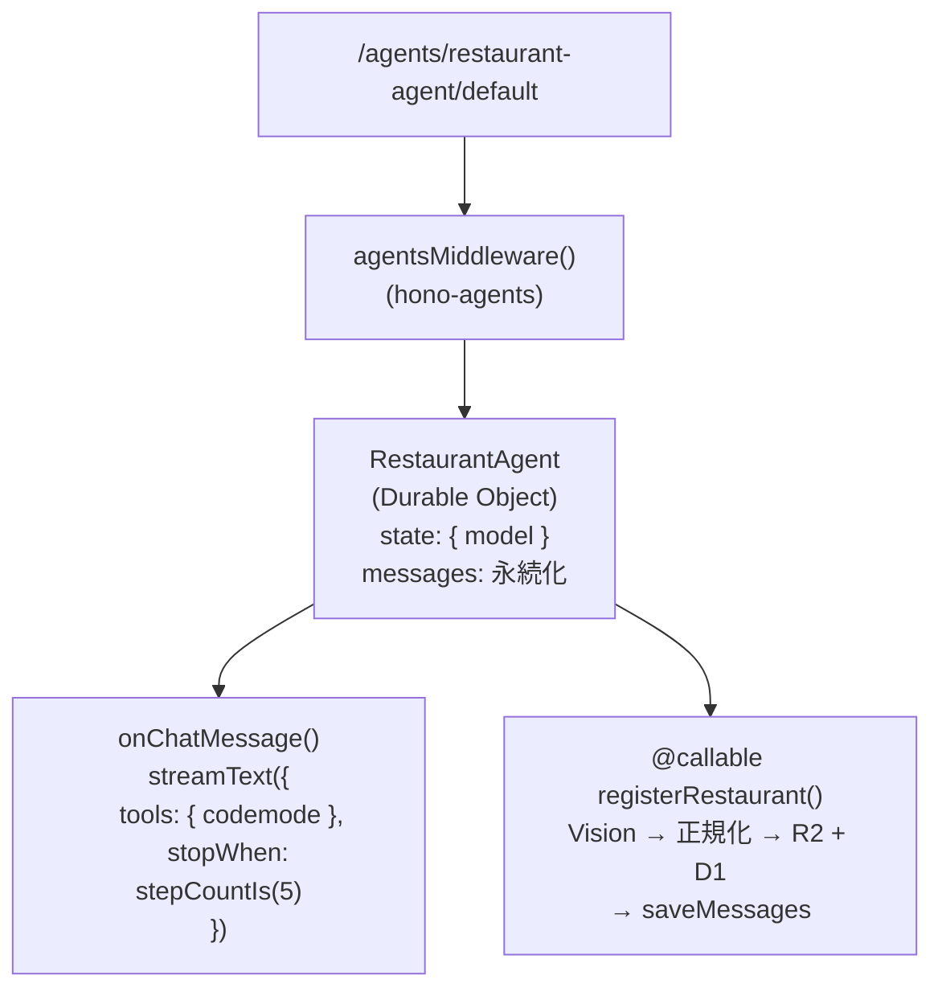
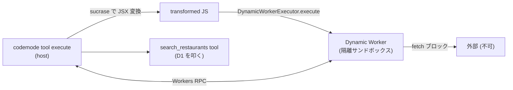
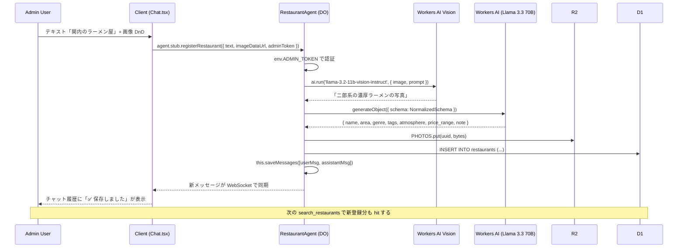

# Generative UI Playground

CopilotKit が提唱する [**Generative UI Spectrum**](https://www.copilotkit.ai/generative-ui-spectrum) (Controlled / Declarative / Open-Ended) を、**Code Mode + Dynamic Worker + React** という一つのプラットフォーム上で **LLM 自身がスペクトラム上を歩く**形で見せるデモ。

2026-06-06 [frontend-phpcon-do-2026](https://fortee.jp/frontend-phpcon-do-2026/proposal/3435cc2a-90b6-4f28-8394-1d0665001020) トーク「AI 時代の UI はどこへ行く？その 2！」用。

## 主要な仕掛け

| 要素                   | 中身                                                                                                                     |
| ---------------------- | ------------------------------------------------------------------------------------------------------------------------ |
| **Code Mode**          | LLM は唯一のツール `codemode` に **JSX を含む async アロー関数**を渡す                                                   |
| **Dynamic Worker**     | その関数は Cloudflare Worker Loader で別 Worker サンドボックスに spawn して実行                                          |
| **React 環境**         | サンドボックスには `react` / `react-dom/server` / `restaurant-ui` (共有 UI コンポーネント) が modules として inject 済み |
| **Response 返却**      | 関数戻り値は擬似 Response `{ contentType, body }`                                                                        |
| **Content-Type 分岐**  | クライアントは Content-Type を見て描画方法を切替: `application/json` / `application/vnd.gui-tree+json` / `text/html`     |
| **コンポーネント借用** | LLM は `<RestaurantList />` を 1 個使うだけでも、raw な `<div>` から組み立てるのも自由                                   |

並走サブテーマ: **「フォーム UI は消える」** — レストラン登録は専用フォームではなく、チャット入力 + 写真 DnD で行い、LLM が曖昧な自然言語入力を正規化する。

## なぜ ModeSelector を撤去したか

最初は ModeSelector で 3 バンドを切り替える設計だったが、**LLM がコードを書く**仕組みに統合した結果、強制スイッチは不要になった:

- ユーザが「シンプルに」と言えば → LLM は `<RestaurantList />` を 1 個借りる (≒ Controlled)
- 「構造化して」と言えば → `application/vnd.gui-tree+json` で Section / Card ツリーを返す (≒ Declarative)
- 「凝った見た目で」と言えば → raw JSX で凝って書き、`text/html` で返す (≒ Open-Ended)

**Spectrum はモードではなく LLM の選択**として現れる、というのが本デモの主張。

## Tech Stack

- Cloudflare Workers + [Hono](https://hono.dev/) + [hono-agents](https://www.npmjs.com/package/hono-agents)
- React 19 + Vite
- [Cloudflare Agents SDK](https://developers.cloudflare.com/agents/) (Durable Object として Agent を保持)
- [@cloudflare/codemode](https://www.npmjs.com/package/@cloudflare/codemode) (LLM が書くコードを Dynamic Worker で実行)
- [@cloudflare/worker-bundler](https://www.npmjs.com/package/@cloudflare/worker-bundler) (React + 共有コンポーネントを runtime でバンドル)
- [sucrase](https://www.npmjs.com/package/sucrase) (LLM 生成コードの JSX → React.createElement トランスパイル)
- Workers AI (Kimi K2.6 / Llama 4 Scout / Llama 3.3 70B / Llama 3.1 8B / Gemma 3 / Qwen 2.5 Coder)
- D1 (レストラン) + R2 (写真)

## 開発

```bash
bun install
bun run dev               # http://localhost:5173/
bun run db:migrate:local  # D1 マイグレーション + シード (横浜 18 件) を投入
```

```bash
bun run cf-typegen        # wrangler.jsonc 変更後、型を再生成
bun run format:fix        # prettier フォーマット
bun run build             # 本番ビルド
bun run deploy            # Cloudflare へデプロイ
```

`.dev.vars` に `ADMIN_TOKEN=local-admin` 等を入れておくと、登録機能が admin 限定になる (本番は `wrangler secret put ADMIN_TOKEN`)。

---

# アーキテクチャ解説

## レイヤ俯瞰



## Layer 1 — Browser

`Chat.tsx` は `useAgentChat` フックで Agent と双方向通信し、返ってきたメッセージの `parts` を `PartView` が type で分岐する。`codemode` ツールの結果は `CodeModeView` がさらに **Content-Type で再分岐**して各種 View を選ぶ。



## Layer 2 — Worker (Hono + Agent)

`/agents/*` を `agentsMiddleware` が引き受け、Durable Object として動く `RestaurantAgent` に到達する。Agent は `state` (model) と `messages` (会話履歴) を SQLite に永続化し、2 つのエントリポイントを持つ。



## Layer 3 — Dynamic Worker サンドボックス

`codemode` ツールの実行時、`@cloudflare/codemode` の `DynamicWorkerExecutor` が `env.LOADER` を使って **隔離 Worker をスピンアップ**し、LLM が書いたコードをそこで走らせる。

サンドボックスには `react` / `react-dom/server` / `restaurant-ui` が **modules として inject 済み**で、LLM のコードは `await import('react')` 等で取り出せる。コードは `globalOutbound: null` で外部 fetch を遮断、ホストとの通信は Workers RPC のみ。



modules:

| Key                | 中身                                                           |
| ------------------ | -------------------------------------------------------------- |
| `react`            | worker-bundler で React を ESM バンドルしたもの                |
| `react-dom/server` | 同上 (renderToString / renderToStaticMarkup)                   |
| `restaurant-ui`    | `src/ui-components.tsx` を worker-bundler で TSX → JS バンドル |

## LLM のコードの形

LLM は `codemode` ツールに以下のような async アロー関数を渡す:

```tsx
// 例 1: 借用全振り (≒ Controlled)
;async (codemode) => {
  const { restaurants } = await codemode.search_restaurants({ area: '関内' })
  return {
    contentType: 'text/html',
    body: '<!doctype html>' + renderToString(<RestaurantList restaurants={restaurants} />),
  }
}

// 例 2: 自分で凝る (≒ Open-Ended)
;async (codemode) => {
  const { restaurants } = await codemode.search_restaurants({ area: '関内' })
  return {
    contentType: 'text/html',
    body:
      '<!doctype html>' +
      renderToString(
        <div style={{ background: '#0f1117', color: '#e6e8ee', padding: 24 }}>
          <h1>関内のおすすめ</h1>
          {restaurants.map((r) => (
            <article key={r.id} style={{ padding: 16, background: '#1d2230', borderRadius: 12 }}>
              <h3>{r.name}</h3>
              <p>{r.note}</p>
            </article>
          ))}
        </div>
      ),
  }
}

// 例 3: シンプル JSON (≒ Controlled、軽量)
;async (codemode) => {
  const { restaurants } = await codemode.search_restaurants({ area: '関内', atmosphere: '静か' })
  return { contentType: 'application/json', body: JSON.stringify({ restaurants }) }
}
```

`codemode.search_restaurants(...)` の呼び出しは **Workers RPC** でホスト Worker に戻り、本物の `search_restaurants` tool が D1 を叩く。

## 「フォーム UI は消える」登録フロー (Admin 限定)



## 主要ファイル

```
src/
  index.tsx                 Hono Worker entry。/agents/* を hono-agents へ
  agent.ts                  RestaurantAgent (AIChatAgent + codemode ツール)
  models.ts                 Model レジストリ (6 モデル, default は Kimi K2.6)
  types.ts                  Restaurant 型 + D1 行 → Restaurant のマッパ
  ui-components.tsx         共有 UI コンポーネント (Chat + Dynamic Worker 両方で使う)
                            ※ インラインスタイル、React のみ依存、self-contained
  schemas/
    declarative.ts          Section / Card プリミティブの Zod (gui-tree+json 用)
  tools/
    code-mode-react.ts      JSX 対応の codemode ツール
                            (sucrase で JSX 変換 + worker-bundler で React 環境用意)
    search-restaurants.ts   D1 をクエリする AI SDK ツール
    add-restaurant.ts       Vision + 正規化 + D1 + R2 の登録パイプライン
  client/
    main.tsx                React entry
    App.tsx                 サイドバー + メインペインのレイアウト
    Chat.tsx                useAgentChat フック + PartView (Content-Type 分岐)
    ModelSelector.tsx       モデルドロップダウン
    modes/
      DeclarativeView.tsx   gui-tree JSON の再帰描画
      OpenEndedView.tsx     iframe sandbox + CSP のラッパ

migrations/                 D1 マイグレーション (init + reseed 横浜 18 件)
wrangler.jsonc              D1 / R2 / Agent (DO) / AI / LOADER バインド
```

## デバグ

dev サーバを `bun run dev` で立ち上げ、Chrome DevTools MCP もしくは普通の DevTools でネットワーク / コンソールを確認。

詳細な現状ステータス（未完了タスク・本番デプロイのために必要な追加手順）は **[AGENTS.md](./AGENTS.md)** を参照。
