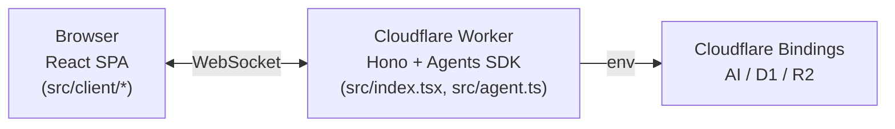
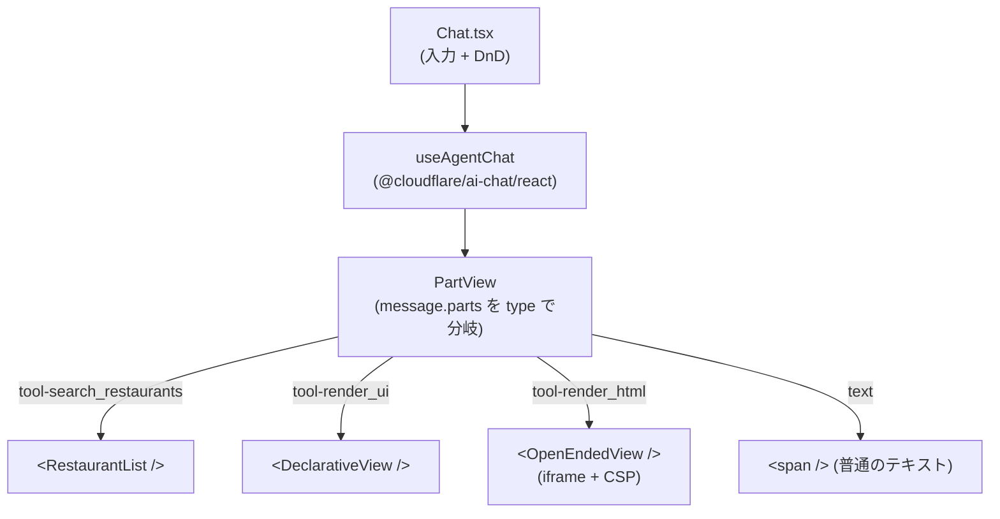
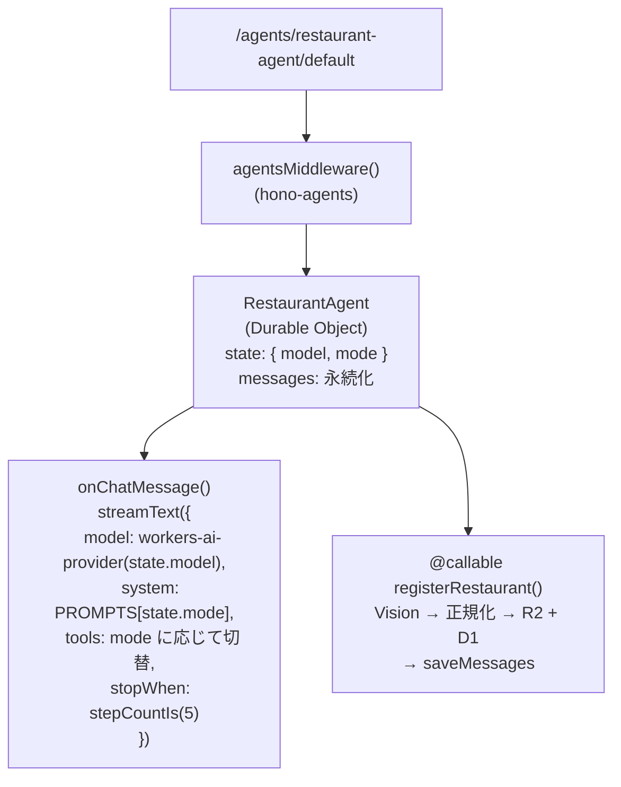
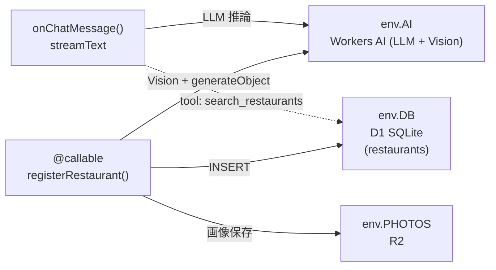
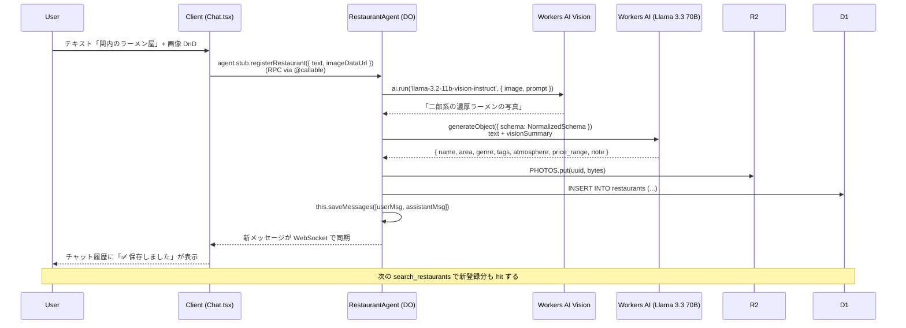

# Generative UI Playground

CopilotKit が提唱する [**Generative UI Spectrum**](https://www.copilotkit.ai/generative-ui-spectrum) の 3 バンド (Controlled / Declarative / Open-Ended) を、同一題材「レストラン提案」で並べて見せるデモ。

2026-06-06 [frontend-phpcon-do-2026](https://fortee.jp/frontend-phpcon-do-2026/proposal/3435cc2a-90b6-4f28-8394-1d0665001020) トーク「AI 時代の UI はどこへ行く？その 2！」用。

## 3 つのバンド

| バンド          | LLM 出力                         | 描画                                     |
| --------------- | -------------------------------- | ---------------------------------------- |
| **Controlled**  | tool call `{ component, props }` | 事前定義 React コンポーネントを dispatch |
| **Declarative** | JSON UI ツリー                   | プリミティブ語彙を再帰的に組立           |
| **Open-Ended**  | HTML + CSS + JS                  | `<iframe sandbox>` + CSP で実行          |

並走サブテーマ: **「フォーム UI は消える」** — レストラン登録は専用フォームではなく、チャット入力 + 写真 DnD で行い、LLM が曖昧な自然言語入力を正規化する。

## Tech Stack

- Cloudflare Workers + [Hono](https://hono.dev/) + [hono-agents](https://www.npmjs.com/package/hono-agents)
- React 19 + Vite
- [Cloudflare Agents SDK](https://developers.cloudflare.com/agents/) (Durable Object として Agent を保持)
- Workers AI (Kimi K2.6 / Llama 4 Scout / Llama 3.3 70B / Llama 3.1 8B / Gemma 3 / Qwen 2.5 Coder)
- D1 (レストラン) + R2 (写真)
- Google Places API (住所正規化 — 未配線)

## 開発

```bash
bun install
bun run dev               # http://localhost:5173/
bun run db:migrate:local  # D1 マイグレーション + シード適用
```

```bash
bun run cf-typegen        # wrangler.jsonc 変更後、型を再生成
bun run format:fix        # prettier フォーマット
bun run build             # 本番ビルド
bun run deploy            # Cloudflare へデプロイ
```

---

# アーキテクチャ解説

## レイヤ俯瞰

ざっくり 3 層構造。下に各層の詳細図を載せる。



### Layer 1 — Browser (React SPA)

`Chat.tsx` は `useAgentChat` フックで Agent と双方向通信し、返ってきたメッセージの `parts` を `PartView` が type で分岐してそれぞれの View に振り分ける。



### Layer 2 — Worker (Hono + Agent)

`/agents/*` を `agentsMiddleware` が引き受け、Durable Object として動く `RestaurantAgent` に到達する。Agent は `state` (model + mode) と `messages` (会話履歴) を SQLite に永続化し、2 つのエントリポイントを持つ。



### Layer 3 — Bindings へのアクセス

`onChatMessage` の中で発火する tool execute と、`registerRestaurant` の登録パイプラインがそれぞれ Cloudflare のバインディングを叩く。



## モード切替の仕組み

UI のセグメントコントロール (`Controlled` / `Declarative` / `Open-Ended`) を押すと、クライアントが `agent.setState({ model, mode })` で **Agent の state を更新**する。Agents SDK は state を WebSocket 経由で双方向同期するため、次の発話時に Agent 側の `this.state.mode` が新しい値になっている。

`onChatMessage` はこの `state.mode` を見て、以下のように振る舞いを切り替える:

```ts
const tools: ToolSet =
  mode === 'controlled'
    ? { search_restaurants: searchTool }
    : mode === 'declarative'
      ? { search_restaurants: searchTool, render_ui: renderUITool }
      : { search_restaurants: searchTool, render_html: renderHTMLTool }

streamText({
  model: workersai(this.state.model),
  system: PROMPTS[mode],   // モードごとに別 system prompt
  tools,                   // モードごとに使えるツールを変える
  ...
})
```

## 各バンドが「カード/JSON/HTML を返す」までのフロー

### Controlled

1. ユーザ「関内で静かに飲みたい」
2. LLM が `search_restaurants({ area: '関内', atmosphere: '静か' })` を tool call
3. AI SDK がツールを実行 → `searchRestaurants()` (src/tools/search-restaurants.ts) が D1 を `SELECT * FROM restaurants WHERE area LIKE ?` でクエリ
4. ツール結果 `{ restaurants: [...] }` がメッセージの parts に `{ type: 'tool-search_restaurants', state: 'output-available', output }` として乗る
5. クライアントの `PartView` (src/client/Chat.tsx) が type を見て `<RestaurantList restaurants={...} />` をレンダ
6. `RestaurantList` が各レストランを `<RestaurantCard>` でマップして並べる

ポイント: LLM は「どのコンポーネントを使うか」を tool 名で表明している（`search_restaurants` → 自動的にカード）。コンポーネントの実装と props 形は完全に開発者の手中にある。

### Declarative

最初の 3 ステップは Controlled と同じ (search_restaurants で D1 から候補取得)。続いて:

- LLM が **2 つ目のツール** `render_ui` を呼ぶ。引数として **Section / Card プリミティブを組み合わせた JSON ツリー** を渡す
- `render_ui` の execute は引数をそのまま返すだけ (echo back)。意味は「LLM の UI 構成意図をクライアントに届ける」こと
- クライアントの PartView が `tool-render_ui` を検出 → `<DeclarativeView ui={...} />` を再帰描画

ポイント: LLM は語彙 (`Card` / `Section`) の中で**自由に配置**できる。開発者は語彙とそのスキーマ (Zod, src/schemas/declarative.ts) を定義しただけ。

### Open-Ended

最初の 3 ステップは同じ。続いて:

- LLM が `render_html` ツールを呼び、**完全な HTML 文書**を引数で渡す (`<html>` から `</html>` まで CSS/JS 含む)
- クライアントが `<OpenEndedView html={...} />` で iframe に流し込み
- `<iframe sandbox="allow-scripts" srcDoc>` + `<meta http-equiv="Content-Security-Policy" content="connect-src 'none'; ...">` で隔離実行

ポイント: 描画の自由度は最大。開発者は CSP の許可リストだけ書いている。

## 「フォーム UI は消える」登録フロー



## 主要ファイル

```
src/
  index.tsx                 Hono Worker entry。/agents/* を hono-agents へ
  agent.ts                  RestaurantAgent (AIChatAgent + Workers AI + tools)
  modes.ts                  Mode 型と一覧 ('controlled' / 'declarative' / 'open-ended')
  models.ts                 Model レジストリ (6 モデル)
  types.ts                  Restaurant 型 + D1 行 → Restaurant のマッパ
  schemas/
    declarative.ts          Section / Card プリミティブの Zod
  tools/
    search-restaurants.ts   D1 をクエリする AI SDK ツール
    render-ui.ts            render_ui / render_html の echo-back ツール
    add-restaurant.ts       Vision + 正規化 + D1 + R2 の登録パイプライン
  client/
    main.tsx                React entry
    App.tsx                 サイドバー + メインペインのレイアウト
    Chat.tsx                useAgent / useAgentChat フックでチャット、part を分岐
    ModeSelector.tsx        セグメントコントロール
    ModelSelector.tsx       モデルドロップダウン
    components/restaurant/  Controlled 用コンポーネント
    modes/
      DeclarativeView.tsx   JSON UI ツリーの再帰描画
      OpenEndedView.tsx     iframe sandbox + CSP のラッパ

migrations/                 D1 マイグレーション (init + seed 18 件)
wrangler.jsonc              D1 / R2 / Agent (DO) / AI バインド
```

## デバグ

dev サーバを `bun run dev` で立ち上げ、Chrome DevTools MCP もしくは普通の DevTools でネットワーク / コンソールを確認。

詳細な現状ステータス（未完了タスク・本番デプロイのために必要な追加手順）は **[AGENTS.md](./AGENTS.md)** を参照。
